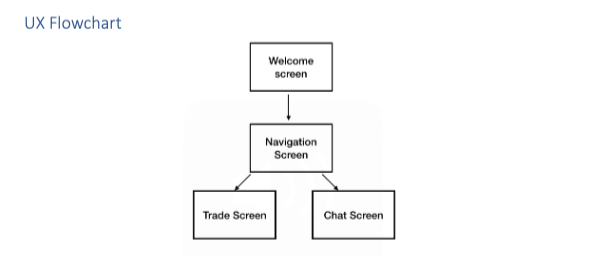

# Trade Wars Client Side
## Overview of SE201 Project
Trade Wars is a multiplayer online game enabling participants to control a spaceship moving through quadrants of space. Players may buy, transport and sell goods at space stations, and communicate with other players. 

Flowchart

A user can do the following:
* Navigate their ship
* Purchase goods
* Sell goods
* Chat with other players

# Screen Specifications
* Welcome screen
* Navigation Screen
* Trade screen
* Chat screen

